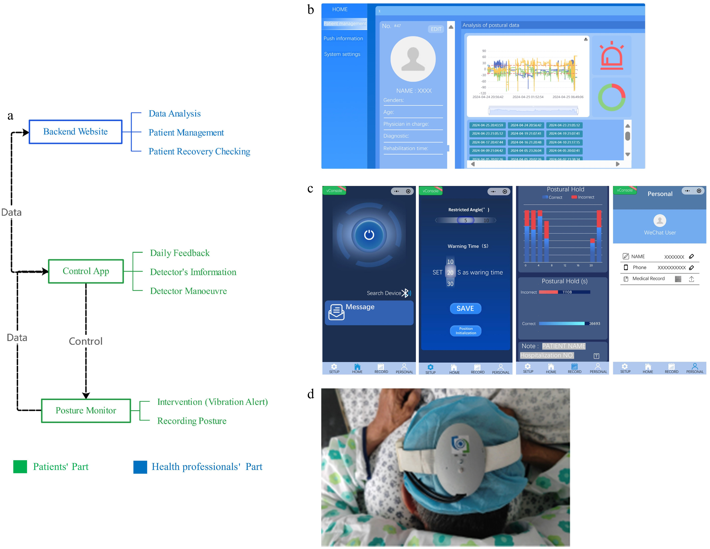
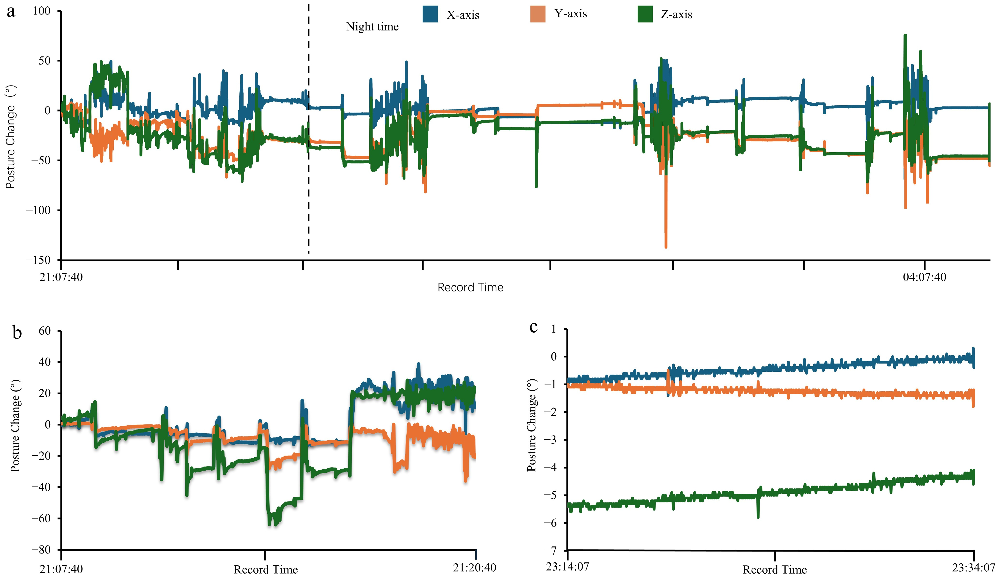
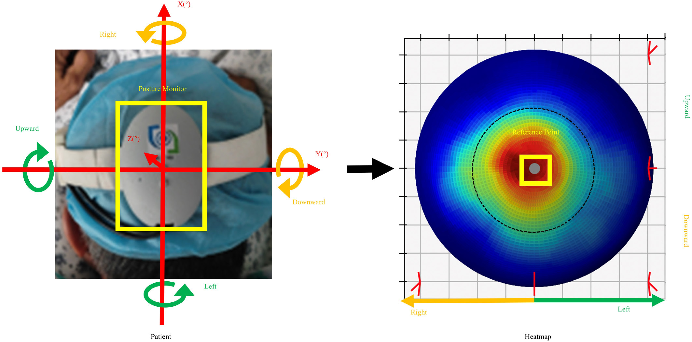
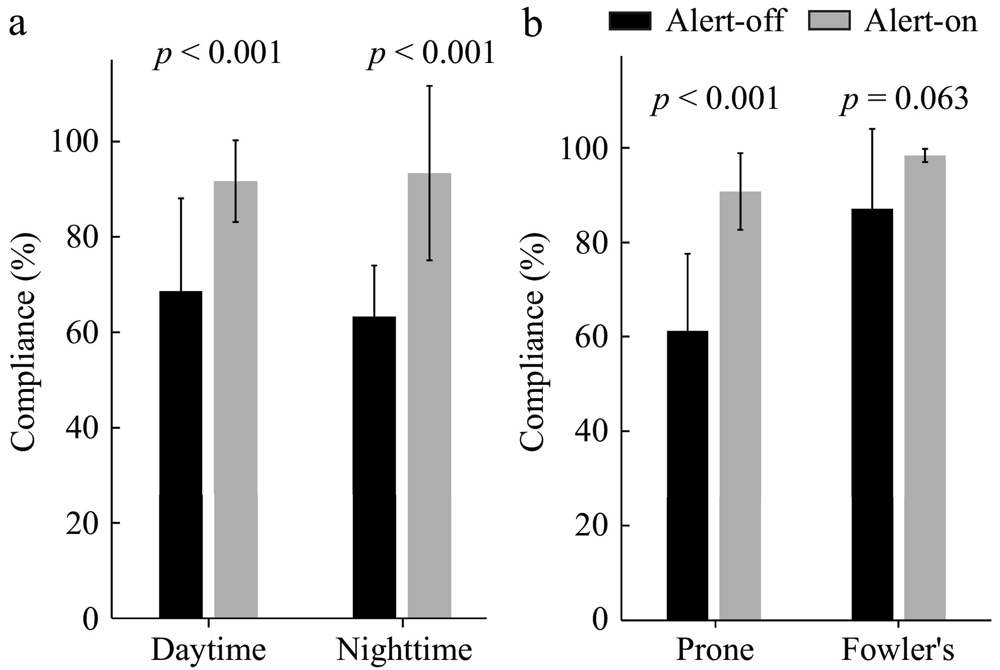
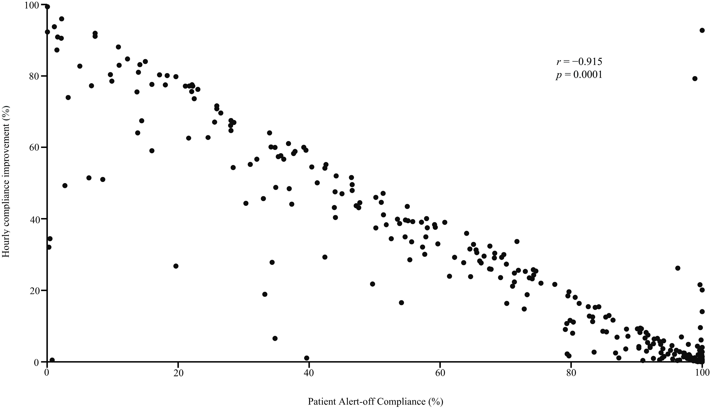
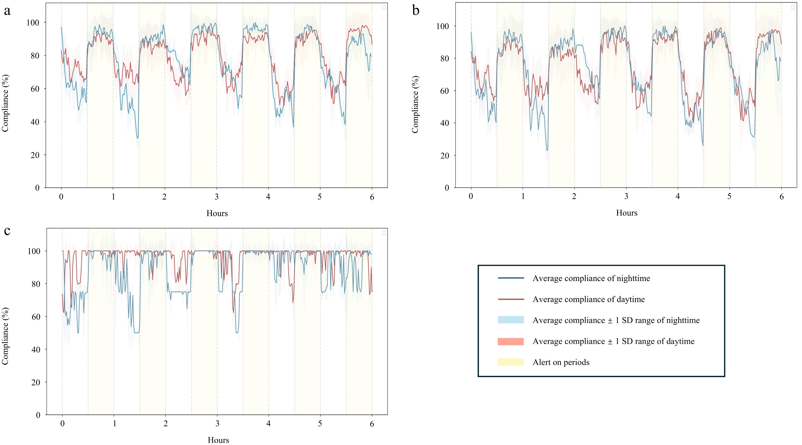
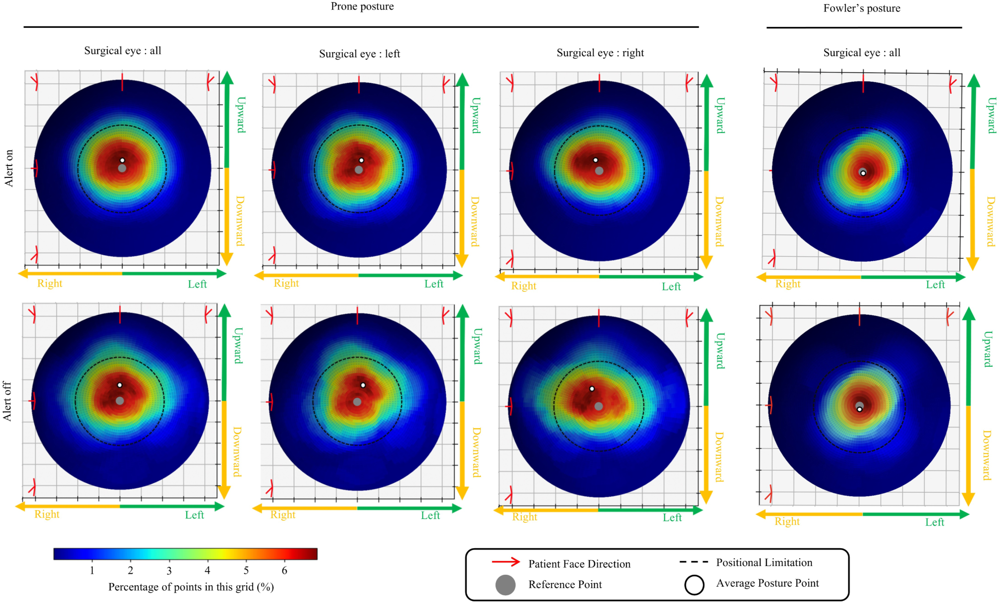

# Posture Compliance Monitor for Retinal Detachment Rehabilitation

<div align="center">
  
  
  
  
  
</div>

A comprehensive system for monitoring patient posture compliance during retinal detachment rehabilitation, consisting of backend API, web interface, mobile application, and data analysis components.

## 📖 Research Publication

This system is the subject of peer-reviewed research published in:

> **Posture Compliance Monitoring System for Retinal Detachment Rehabilitation**  
> DOI: [10.48130/vns-0025-0014](https://www.maxapress.com/article/doi/10.48130/vns-0025-0014)  
> Published in Visual Neuroscience, 2025

### Citation

```bibtex
@article{posture_compliance_2025,
  title={Posture Compliance Monitoring System for Retinal Detachment Rehabilitation},
  author={SheathedSharp(Zixian Zhu)},
  journal={Visual Neuroscience},
  year={2025},
  doi={10.48130/vns-0025-0014},
  url={https://www.maxapress.com/article/doi/10.48130/vns-0025-0014}
}
```

## 🎯 System Overview

This research project implements a multi-platform posture monitoring system with the following components:

- **🔧 Backend** (Node.js/Express) - REST API server with MySQL database
- **🖥️ Web Frontend** (Vue.js 2) - Healthcare provider interface with 3D visualization  
- **📱 Mini-program** (WeChat Mini Program) - Patient mobile application with Bluetooth connectivity
- **🐍 Data Analysis** (Python) - Machine learning models and compliance analysis

### System Architecture Overview

<div align="center">
  
  <p><em>Figure 1: Complete system architecture showing multi-platform integration</em></p>
</div>

### Hardware Components and Sensor Integration

<div align="center">
  
  <p><em>Figure 2: Sensor hardware and positioning device specifications</em></p>
</div>

## 🏗️ Architecture

### Backend API
- RESTful API endpoints for doctor and patient operations
- MySQL database for patient records and posture data
- WebSocket support for real-time communication
- CORS configured for cross-platform access

### Web Interface
- Vue.js 2 with Vue Router and Vuex
- Three.js integration for 3D eyeball simulation
- Element UI components for interface
- Real-time posture angle visualization

### WeChat Mini Program
- Bluetooth device integration
- Patient data upload and progress tracking
- User authentication and management
- Core posture degree processing modules

### Python Data Analysis
- Machine learning models (exponential, quadratic)
- Patient compliance analysis and visualization
- Position data processing and categorization
- Day/night analysis separation

## 💻 Technology Stack

<div align="center">

| Component | Technologies | Purpose |
|-----------|-------------|---------|
| **Backend** | Node.js, Express, MySQL, WebSocket | API services & data management |
| **Web Frontend** | Vue.js 2, Vuex, Vue Router, Three.js | Healthcare provider interface |
| **Mobile App** | WeChat Mini Program, Bluetooth API | Patient data collection |
| **Data Analysis** | Python, Pandas, NumPy, Matplotlib | ML models & statistical analysis |
| **Database** | MySQL | Patient records & posture data |
| **Visualization** | Three.js, ECharts, D3.js | 3D eyeball simulation & charts |

</div>

### User Interface Design

<div align="center">
  
  <p><em>Figure 3: Web interface and mobile application user interface design</em></p>
</div>

## 🌟 Key Features

### 🏥 For Healthcare Providers
- **Real-time Monitoring Dashboard**: Track patient compliance in real-time
- **3D Eyeball Visualization**: Interactive 3D model showing patient positioning
- **Compliance Analytics**: Detailed reports on patient adherence patterns
- **Alert System**: Notifications for non-compliance events
- **Historical Data Analysis**: Trend analysis and progress tracking

### 📱 For Patients
- **Mobile App Interface**: Easy-to-use WeChat mini-program
- **Bluetooth Device Integration**: Seamless sensor connectivity
- **Progress Tracking**: Visual feedback on compliance performance
- **Educational Content**: Guidance on proper positioning techniques
- **Real-time Feedback**: Immediate alerts for position corrections

### 🔬 For Researchers
- **Data Export**: CSV/Excel export for further analysis
- **Machine Learning Models**: Pre-trained compliance prediction models
- **Statistical Tools**: Advanced analytics for research purposes
- **Anonymized Datasets**: Privacy-compliant data for studies

## Setup and Installation

### Prerequisites
- Node.js 14+ and npm
- Python 3.7+ with pip
- MySQL 5.7+
- WeChat Developer Tools (for mini-program)

### Environment Configuration

1. Copy the environment configuration:
   ```bash
   cp .env.example .env
   ```

2. Configure your database credentials and other settings in `.env`

### Backend Setup
```bash
cd backend
npm install
npm run test  # Development server with nodemon
```

### Web Frontend Setup
```bash
cd web
npm install
npm run serve  # Development server
npm run build  # Production build
```

### Mini-program Setup
```bash
cd mini-program
npm install
# Use WeChat Developer Tools for compilation and testing
```

### Python Analysis Setup
```bash
cd script
python -m pip install -r requirements.txt
# Run analysis scripts as needed
python get_position_Axyz_revision_LR.py
```

## Data Processing Pipeline

The system processes patient posture data through several stages:

1. **Data Collection**: Bluetooth sensors collect angle measurements
2. **Position Analysis**: Raw data processed to determine posture positions (FD, SS, RL)
3. **Compliance Calculation**: Machine learning models analyze adherence patterns
4. **Visualization**: Generate compliance reports and 3D visualizations

## File Structure

- `/backend/` - Node.js API server
- `/web/` - Vue.js web application
- `/mini-program/` - WeChat mini-program
- `/script/` - Python data analysis tools
- `/script/model/` - Machine learning models
- `/script/utils/` - Analysis utilities
- `/script/data/position_data/` - Processed position data (CSV files)
- `/docs/images/` - Research paper figures and documentation images

## 🔬 Research Context

This system was developed for clinical research on posture compliance during retinal detachment rehabilitation. The research addresses the critical need for accurate monitoring of patient positioning during post-operative recovery, which is essential for successful retinal reattachment.

### Key Research Findings

- **📊 Compliance Monitoring**: Real-time tracking of patient posture with high accuracy
- **🤖 Machine Learning**: Advanced models for predicting compliance patterns
- **📱 Patient Engagement**: Mobile interface improves patient adherence
- **🏥 Clinical Integration**: Seamless workflow for healthcare providers

### Research Results

#### Data Collection and Processing Pipeline

<div align="center">
  
  <p><em>Figure 4: Data collection workflow and processing pipeline</em></p>
</div>

#### Patient Positioning Analysis

<div align="center">
  
  <p><em>Figure 5: Analysis of different patient positioning patterns and compliance metrics</em></p>
</div>

#### Clinical Validation Results

<div align="center">
  
  <p><em>Figure 6: Clinical study results showing system effectiveness and patient outcomes</em></p>
</div>

#### Machine Learning Model Performance

<div align="center">
  
  <p><em>Figure 7: Machine learning model performance evaluation and compliance prediction accuracy</em></p>
</div>

## 📈 Clinical Impact

The system has demonstrated significant improvements in:
- Patient compliance rates with posturing requirements
- Clinical outcomes in retinal detachment cases
- Healthcare provider monitoring efficiency
- Patient education and engagement

## 🧪 Research Methodology

The study employed:
- **Multi-platform data collection** across web, mobile, and sensor devices
- **Machine learning algorithms** for compliance pattern analysis
- **Clinical validation** with anonymized patient data
- **Statistical analysis** of compliance outcomes

## 📄 License

This project is released under academic license for research and educational purposes.

### Academic Use
- ✅ Research and educational use permitted
- ✅ Citation required when using in academic work
- ✅ Modification and distribution allowed with attribution

### Commercial Use
- ❌ Commercial use requires separate license agreement
- 📧 Contact authors for commercial licensing inquiries

## 🔐 Data Privacy & Ethics

All patient data files and personal information have been removed or anonymized to protect patient privacy in compliance with:
- **HIPAA** (Health Insurance Portability and Accountability Act)
- **Medical Research Ethics** guidelines
- **Data Protection Regulations**

The system is designed to work with anonymized patient identifiers and maintains the highest standards of data privacy.

## 📞 Contact & Support

For questions about this research or system implementation:
- 📝 Paper: https://www.maxapress.com/article/doi/10.48130/vns-0025-0014
- 🐛 Issues: Use GitHub Issues for technical problems

## 🙏 Acknowledgments

We thank all patients, healthcare providers, and research collaborators who contributed to this study. Special recognition to the clinical teams who validated the system in real-world healthcare settings.
